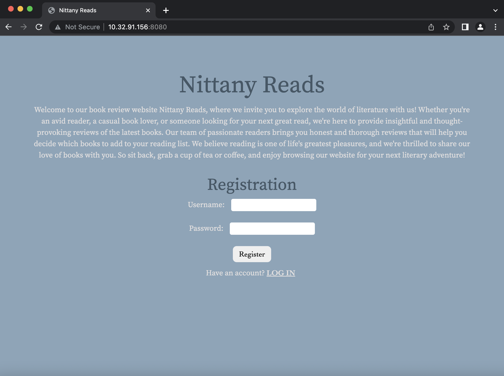
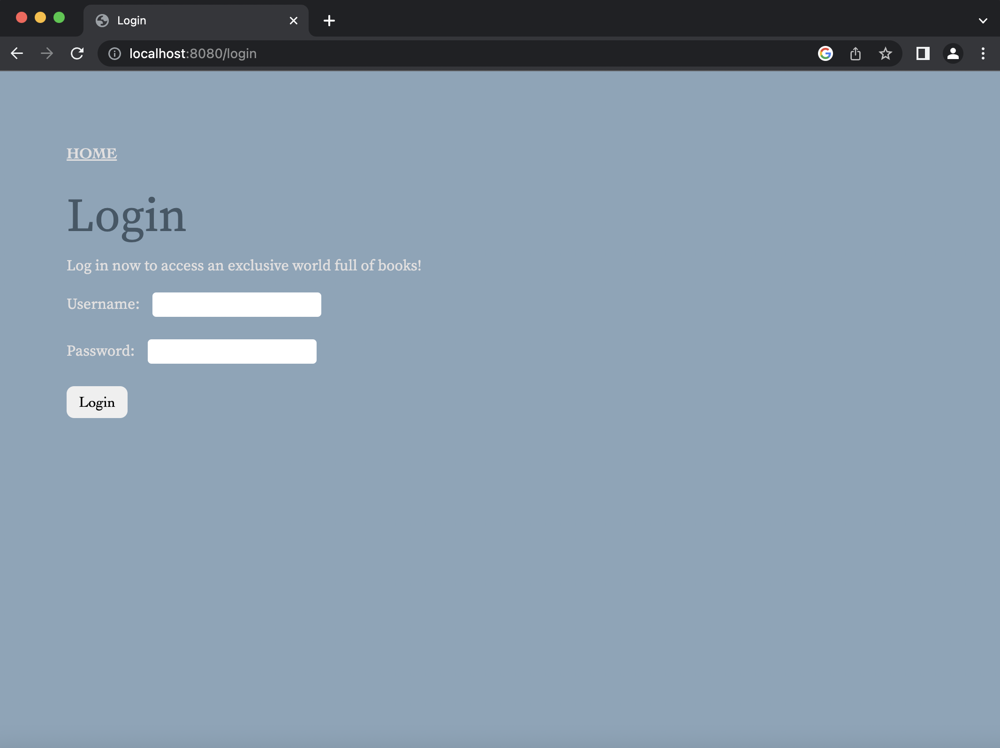
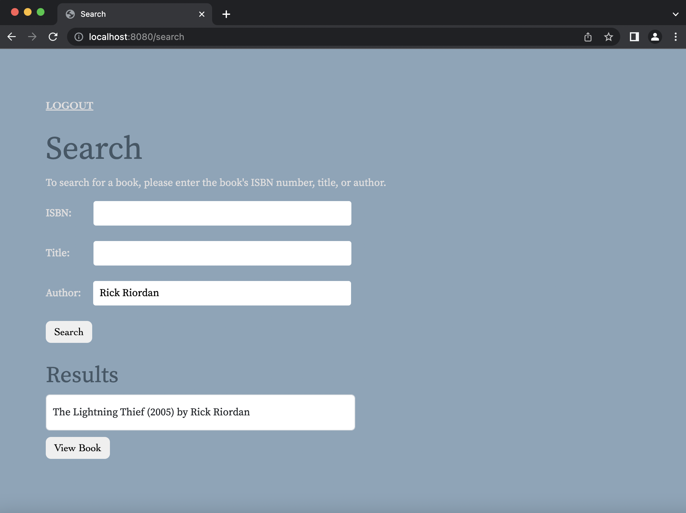
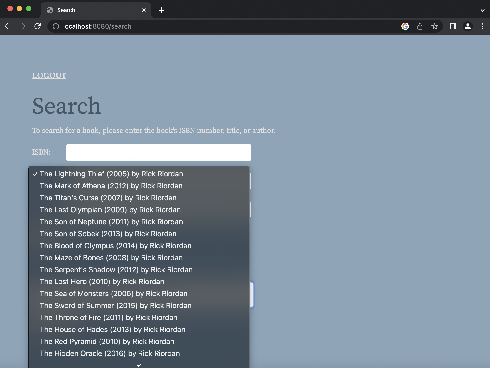
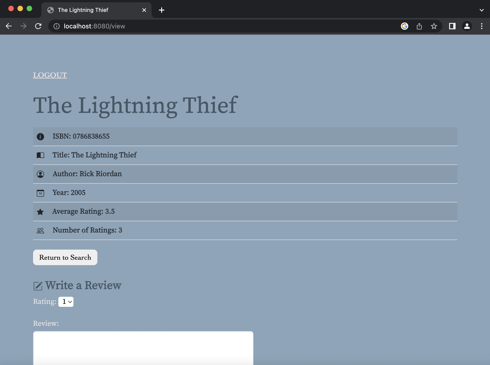
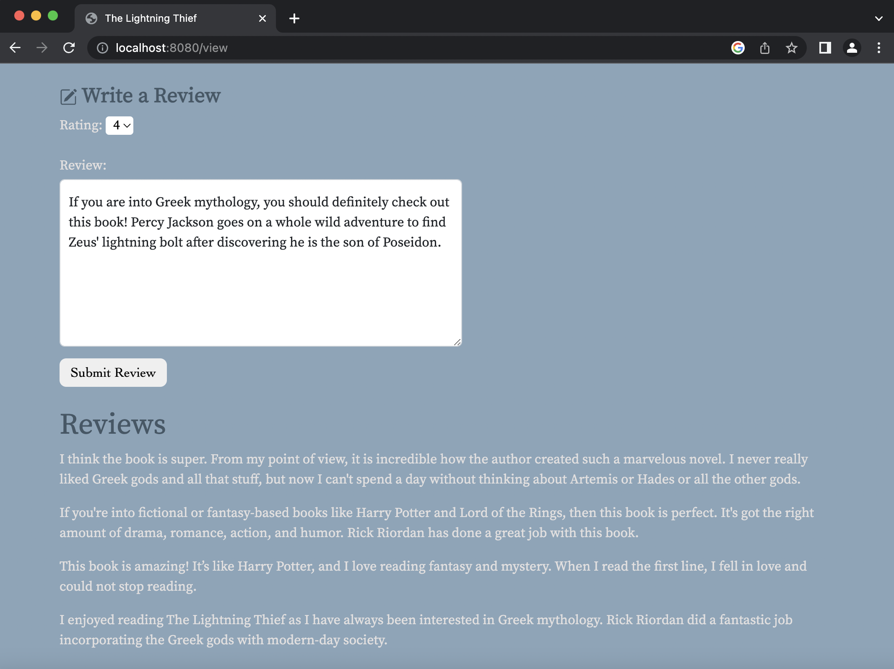
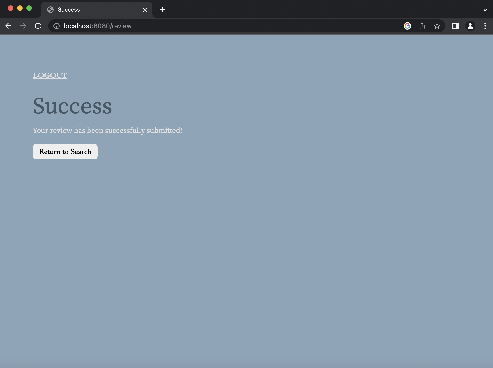
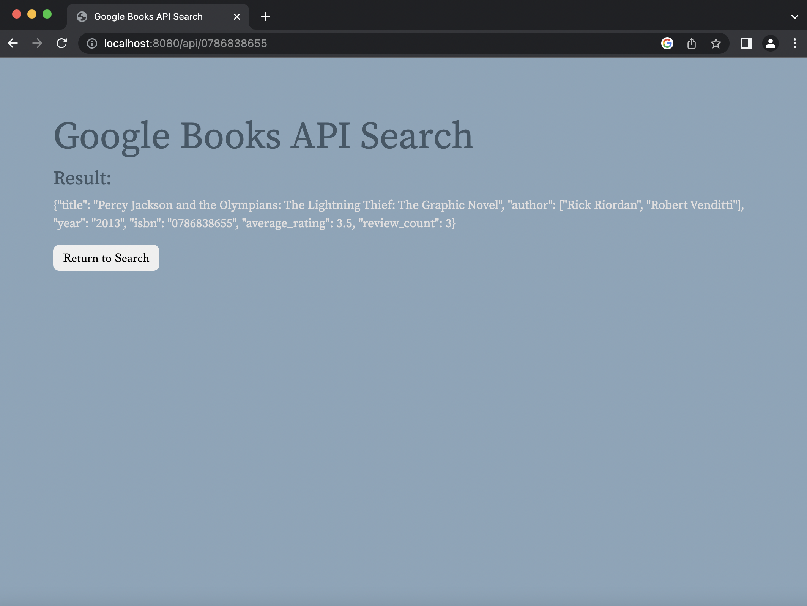

# Nittany Reads

*February 2023 - April 2023*

Nittany Reads—a book review platform—is a simple web application that allows users to create an account, search for books, view book details, and write reviews. Users can also directly search for a book's information using the /api/< isbn > route. 

## Technologies
- **Languages:** Python, SQL, HTML, CSS
- **Frameworks/Libraries:** Flask, SQLAlchemy, Bootstrap
- **Database:** PostgreSQL
- **API:** Google Books API

## Challenges
Below are some of the challenges I faced while working on the project.
- When users reload the webpage, a 405 Method Not Allowed message pops up. I have yet to figure out a way for users to successfully refresh their page. 
- For this project, I also utilized Flask-Session. Although, I had difficulties storing certain attributes in session. The only item I successfully set in the session was the user's ID number (1, 2, 3, ..., n). This unique ID number is the serial primary key of the "users" table in the database, and it is assigned to the user when they register an account. 
- The letters do not hide with * when users enter their passwords.

## Preview
Users will first be directed to the home page, where they can register an account for themselves. An error message will appear if the user enters an already existing username. Those that already have an account can go to the login page by clicking "LOG IN."

To enter the book review site, users will need to log in using their username and password. An error message will pop up if the users enter their information incorrectly.

After arriving on the search page, users can look up their book of interest by ISBN, book title, or author name. To note, for a successful search, only one of the fields can be filled before pressing "Search." The application also supports searches where the ISBN, book title or author name is incomplete. If the book does not exist in the database, an error message will appear to notify the user. In the example below, the user searched for his book by the author's name, which is Rick Riordan.

Under "Results," users are given a drop-down list where they can find their desired books. This feature is helpful for those who submitted incomplete parts of the ISBN, book title, or author name. 

After selecting "View Book," users are brought to a new page that provides them with information on the book, including ISBN, book title, author name, publication year, average rating, and number of ratings.  

The book page also features a text area where users can write a review and leave a rating for the selected book. Each user is only allowed to leave one review per book. Below the text area, users can also view the reviews written by other readers.

After users submit a review, they will receive an error or success message to let them know whether or not their review submission was successful. An error message is only given when the user has already submitted a review for the book. 

If users use the /api/< isbn > route, they will be taken to a page displaying a JSON object containing information on their desired book.

